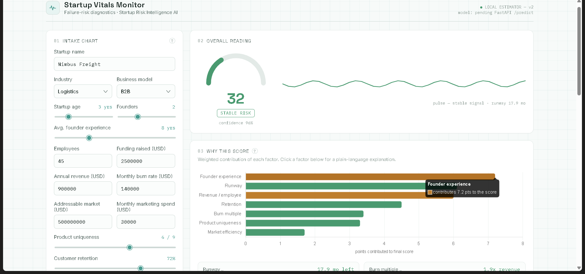

# Startup Risk Intelligence AI

Startup Risk Intelligence AI is a startup failure-risk analysis project. It combines an exploratory data-science workflow with a browser-based dashboard for reviewing financial, operational, and market signals.

## Project Status

### Available now

- Raw startup dataset with financial and operating indicators
- Exploratory analysis notebook
- Saved startup risk model artifact
- Interactive **Startup Vitals Monitor** frontend
- Transparent local risk estimator with charts and explanations

### In progress

- FastAPI prediction service
- Connection between the frontend and the saved model
- Production training and evaluation workflow

## Frontend Dashboard

The dashboard accepts startup information and displays:

- Overall risk score and confidence
- Risk classification: stable, elevated, or critical
- Weighted factor contributions
- Health profile radar chart
- Cash runway projection
- Comparison with dataset averages
- Reliability warnings for inputs outside observed dataset ranges



### Run the dashboard

The simplest option is to open [frontend/index.html](frontend/index.html) directly in a browser.

For a local development server, run this command from the repository root:

```bash
python -m http.server 8000 --directory frontend
```

Then open <http://localhost:8000>.

The frontend is currently self-contained. Its local estimator is implemented in [frontend/script.js](frontend/script.js); the dashboard is prepared for a future FastAPI `/predict` integration.

## Data

The source dataset is stored in [data/raw/startup_failure_prediction.csv](data/raw/startup_failure_prediction.csv). It includes fields such as:

- Startup name, industry, and business model
- Startup age and number of founders
- Founder experience and employee count
- Funding, revenue, burn rate, and marketing expense
- Market size, product uniqueness, and customer retention
- Startup status, used as the prediction target

## Model And Analysis

- Exploratory analysis: [notebooks/01_eda.ipynb](notebooks/01_eda.ipynb)
- Saved model artifact: [models/startup_risk_model.pkl](models/startup_risk_model.pkl)
- Frontend heuristic: [frontend/script.js](frontend/script.js)

The frontend currently calculates a transparent estimate locally. The saved model is not yet served through an API.

## Repository Structure

```text
Startup-Risk-Intelligence-AI/
├── data/
│   └── raw/
│       └── startup_failure_prediction.csv
├── frontend/
│   ├── assets/
│   │   └── vitals-monitor-preview.png
│   ├── index.html
│   ├── script.js
│   └── style.css
├── models/
│   └── startup_risk_model.pkl
├── notebooks/
│   └── 01_eda.ipynb
└── README.md
```

## Technology

- Python and Jupyter Notebook
- Pandas, NumPy, and scikit-learn
- HTML, CSS, and JavaScript
- Chart.js for dashboard visualizations
- Pickle model artifact for the current saved model

## Next Steps

1. Build the FastAPI `/predict` endpoint.
2. Define and validate the model input schema.
3. Connect `frontend/script.js` to the API.
4. Evaluate model performance on a held-out dataset.
5. Add model explainability and deployment configuration.

